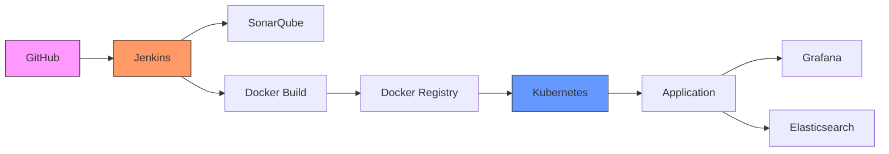

# 🚀 CI/CD DevOps Automation avec Jenkins, Docker & Kubernetes


## 📋 Table des matières
- [🎯 Vue d'ensemble](#-vue-densemble)
- [🏗 Architecture](#-architecture)
- [📦 Prérequis](#-prérequis)
- [⚙️ Installation](#️-installation)
- [🚀 Utilisation](#-utilisation)
- [🔧 Configuration](#-configuration)
- [📊 Monitoring](#-monitoring)
- [🤝 Contribution](#-contribution)
- [📄 Licence](#-licence)
- [👤 Auteur](#-auteur)

## 🎯 Vue d'ensemble

Ce projet implémente un **pipeline CI/CD DevOps complet** permettant le déploiement automatique d'une application **Spring Boot** à chaque `git push`. L'architecture intègre les meilleures pratiques DevOps avec des outils modernes pour l'intégration, le déploiement et la supervision.

## 🏗 Architecture



## 📦 Prérequis

### 🛠 Outils requis
- **Java 17+**
- **Maven 3.6+**
- **Docker 20.10+**
- **Kubernetes 1.24+** (ou Minikube)
- **Jenkins 2.387+**
- **SonarQube 9.9+**
- **Git 2.35+**

### 🌐 Services cloud (optionnels)
- Docker Hub ou Registry privé
- Cluster Kubernetes (local ou cloud)

## ⚙️ Installation

### 1. Configuration de Jenkins
```bash
# Installation sur Ubuntu/Debian
sudo apt update
sudo apt install jenkins

# Démarrage du service
sudo systemctl start jenkins
sudo systemctl enable jenkins

# Accéder à Jenkins
# http://localhost:8080
```

### 2. Plugins Jenkins requis
Installer les plugins suivants via Jenkins Dashboard:
- **Git**
- **Docker Pipeline**
- **Kubernetes**
- **SonarQube Scanner**
- **Blue Ocean**
- **Pipeline Utility Steps**

### 3. Configuration du projet
Clonez le dépôt et configurez les fichiers:
```bash
git clone https://github.com/votre-utilisateur/votre-repo.git
cd votre-repo
```

## 🚀 Utilisation

### Pipeline Jenkins
Le pipeline est défini dans le fichier `Jenkinsfile`:

```groovy
pipeline {
    agent any
    environment {
        DOCKER_REGISTRY = 'docker.io'
        DOCKER_IMAGE = 'votre-utilisateur/springboot-app'
        K8S_NAMESPACE = 'default'
    }
    stages {
        // Voir le Jenkinsfile complet dans le projet
    }
}
```

### Démarrage du pipeline
1. Créez un nouveau pipeline dans Jenkins
2. Sélectionnez "Pipeline from SCM"
3. Configurez votre dépôt Git
4. Lancez le pipeline manuellement ou configurez les webhooks GitHub

## 🔧 Configuration

### Structure des fichiers
```
.
├── src/
│   └── main/
├── pom.xml
├── Dockerfile
├── Jenkinsfile
├── k8s/
│   ├── deployment.yaml
│   ├── service.yaml
│   └── ingress.yaml
├── docker-compose.yml
└── README.md
```

### Configuration Kubernetes
Exemple de fichier `deployment.yaml`:
```yaml
apiVersion: apps/v1
kind: Deployment
metadata:
  name: springboot-app
spec:
  replicas: 3
  selector:
    matchLabels:
      app: springboot-app
  template:
    metadata:
      labels:
        app: springboot-app
    spec:
      containers:
      - name: app
        image: votre-utilisateur/springboot-app:latest
        ports:
        - containerPort: 8080
```

### Variables d'environnement
Configurez ces variables dans Jenkins:
- `SONAR_HOST_URL`: URL de votre instance SonarQube
- `DOCKER_USERNAME`: Identifiant Docker Hub
- `DOCKER_PASSWORD`: Token Docker Hub
- `KUBECONFIG`: Configuration du cluster Kubernetes

## 📊 Monitoring

### Grafana Dashboard
Accédez aux métriques de l'application via Grafana:
```bash
# Port-forward pour accéder à Grafana
kubectl port-forward svc/grafana 3000:3000
# http://localhost:3000
```

### Logs avec Elasticsearch
Consultez les logs d'application:
```bash
# Recherche dans les logs
kubectl logs -l app=springboot-app --tail=50
```

## 🤝 Contribution

Les contributions sont les bienvenues! Veuillez suivre ces étapes:

1. Forkez le projet
2. Créez une branche (`git checkout -b feature/AmazingFeature`)
3. Commitez vos changements (`git commit -m 'Add some AmazingFeature'`)
4. Pushez sur la branche (`git push origin feature/AmazingFeature`)
5. Ouvrez une Pull Request

## 📄 Licence

Ce projet est sous licence MIT. Voir le fichier `LICENSE` pour plus de détails.

## 👤 Auteur

**Wajdi Ben Ameur**
- 📧 Email: ben.ameur.wajdi@gmail.com
- 🌐 LinkedIn: [linkedin.com/in/wajdibenameur](https://linkedin.com/in/wajdi-ben-ameur)


---
<div align="center">

### 📚 Étudiant en Ingénierie Logicielle & DevOps
### 🇹🇳 Tunisie

[⬆ Retour en haut](#-cicd-devops-automation-avec-jenkins-docker--kubernetes)

</div>