# 🚀 CI/CD DevOps Automation avec Jenkins, Docker & Kubernetes


## 📋 Sommaire
- [🎯 Vue d'ensemble](#-vue-densemble)
- [🏗 Architecture](#-architecture)
- [🚀 Installation rapide](#-installation-rapide)
- [⚡ Pipeline Jenkins](#-pipeline-jenkins)
- [🔗 Exposition avec Ngrok](#-exposition-avec-ngrok)
- [💻 Accès SSH MobaXterm](#-accès-ssh-mobaxterm)
- [📁 Fichiers clés](#-fichiers-clés)
- [🔧 Dépannage rapide](#-dépannage-rapide)
- [👤 Auteur](#-auteur)

## 🎯 Vue d'ensemble
Ce projet implémente un pipeline CI/CD DevOps complet déployé sur une VM Ubuntu 24.04 permettant le déploiement automatique d'une application Angular à chaque `git push`. Le pipeline utilise Jenkins avec Blue Ocean, expose Jenkins via Ngrok pour les webhooks GitHub, et permet l'accès SSH via MobaXterm:

- **Jenkins + Blue Ocean** : Automatisation
- **Docker + Minikube** : Conteneurisation
- **Ngrok** : Exposition sécurisée
- **MobaXterm** : Accès SSH

## 🏗 Architecture



```mermaid
graph TB
    A[GitHub] -->|Webhook| B[Ngrok Tunnel]
    B --> C[Jenkins sur VM Ubuntu 24.04]
    C --> D[Blue Ocean Interface]
    D --> E[Pipeline CI/CD]
    E --> F[Docker Build dans Minikube]
    F --> G[Kubernetes Deployment]
    G --> H[Application Angular]
    
    I[Utilisateur] -->|SSH| J[MobaXterm]
    J --> C
    
    style A fill:#181717,stroke:#333
    style B fill:#1F1E37,stroke:#333
    style C fill:#E95420,stroke:#333
    style J fill:#FF6600,stroke:#333
```

## 🚀 Installation rapide

### 1. VM Ubuntu 24.04
```bash
# Mise à jour système
sudo apt update && sudo apt upgrade -y

# Outils de base
sudo apt install -y git curl wget
```

### 2. Java (prérequis Jenkins)
```bash
sudo apt install -y openjdk-17-jdk
```

### 3. Jenkins + Blue Ocean
```bash
# Installation Jenkins
curl -fsSL https://pkg.jenkins.io/debian/jenkins.io-2023.key | sudo tee \
  /usr/share/keyrings/jenkins-keyring.asc > /dev/null
echo deb [signed-by=/usr/share/keyrings/jenkins-keyring.asc] \
  https://pkg.jenkins.io/debian binary/ | sudo tee \
  /etc/apt/sources.list.d/jenkins.list > /dev/null
sudo apt update
sudo apt install -y jenkins

# Démarrage
sudo systemctl start jenkins
sudo systemctl enable jenkins

# Mot de passe initial
sudo cat /var/lib/jenkins/secrets/initialAdminPassword
```

### 4. Docker & Minikube
```bash
# Docker
curl -fsSL https://get.docker.com -o get-docker.sh
sudo sh get-docker.sh
sudo usermod -aG docker $USER
sudo usermod -aG docker jenkins

# Minikube
curl -LO https://storage.googleapis.com/minikube/releases/latest/minikube-linux-amd64
sudo install minikube-linux-amd64 /usr/local/bin/minikube

# Kubectl
curl -LO "https://dl.k8s.io/release/$(curl -L -s https://dl.k8s.io/release/stable.txt)/bin/linux/amd64/kubectl"
sudo install -o root -g root -m 0755 kubectl /usr/local/bin/kubectl

# Démarrer Minikube
minikube start --driver=docker
```

### 5. Ngrok
```bash
# Installation (Ubuntu 24.04)
curl -s https://ngrok-agent.s3.amazonaws.com/ngrok.asc | sudo tee /etc/apt/trusted.gpg.d/ngrok.asc >/dev/null
echo "deb https://ngrok-agent.s3.amazonaws.com jammy main" | sudo tee /etc/apt/sources.list.d/ngrok.list
sudo apt update
sudo apt install ngrok

# Configuration (obtenez votre token sur ngrok.com)
ngrok config add-authtoken VOTRE_TOKEN
```

## ⚡ Pipeline Jenkins

### Jenkinsfile principal
```groovy
pipeline {
    agent any
    environment {
        COMMIT_ID = ''
    }
    stages {
        stage('Preparation') {
            steps {
                checkout scm
                script {
                    COMMIT_ID = sh(script: 'git rev-parse --short HEAD', returnStdout: true).trim()
                }
            }
        }
        stage('Build Angular') {
            steps {
                sh 'npm install'
                sh 'ng build --configuration=production'
            }
        }
        stage('Docker Build') {
            steps {
                sh "docker build -t angular-app:${COMMIT_ID} ."
            }
        }
        stage('Deploy') {
            steps {
                sh "kubectl apply -f manifests/"
            }
        }
    }
}
```

### Plugins requis
- Blue Ocean (interface visuelle)
- Git & GitHub Integration
- Docker Pipeline
- Kubernetes

## 🔗 Exposition avec Ngrok

### 1. Tunnel pour Jenkins
```bash
# Lancer Ngrok
ngrok http 8080
```
→ URL Ngrok affichée (ex: `https://abc123.ngrok.io`)

### 2. Webhook GitHub
```
Settings → Webhooks → Add webhook
Payload URL: https://abc123.ngrok.io/github-webhook/
Content type: application/json
Events: Just the push event
```

## 💻 Accès SSH MobaXterm

### Configuration
1. **Ouvrez MobaXterm** → **Session** → **SSH**
2. **Remote host** : IP de votre VM
3. **Username** : utilisateur VM
4. **Port** : 22
5. **Advanced SSH settings** → Use private key (si authentification par clé)

### Fonctionnalités utiles
- Glisser-déposer pour transférer des fichiers
- Éditeur intégré pour modifier les fichiers
- Terminal multi-onglets
- Explorateur de fichiers SFTP

## 📁 Fichiers clés

### Structure minimale
```
├── Dockerfile              # Image Nginx + Angular
├── Jenkinsfile            # Pipeline CI/CD
├── nginx.conf            # Configuration Nginx
├── manifests/
│   ├── deployment.yaml   # Déploiement Kubernetes
│   └── service.yaml     # Service Kubernetes
└── src/                  # Code Angular
```

### Dockerfile essentiel
```dockerfile
FROM nginx:alpine
RUN rm -rf /usr/share/nginx/html/*
COPY dist/ /usr/share/nginx/html/
COPY nginx.conf /etc/nginx/nginx.conf
CMD ["nginx", "-g", "daemon off;"]
```

### manifests/deployment.yaml
```yaml
apiVersion: apps/v1
kind: Deployment
metadata:
  name: angular-app
spec:
  replicas: 2
  selector:
    matchLabels:
      app: angular-app
  template:
    metadata:
      labels:
        app: angular-app
    spec:
      containers:
      - name: app
        image: angular-app:TAG  # Remplacé par Jenkins
        ports:
        - containerPort: 80
```

## 🔧 Dépannage rapide

### Problèmes fréquents

| Problème | Solution |
|----------|----------|
| Jenkins inaccessible | `sudo systemctl restart jenkins` |
| Minikube ne démarre pas | `minikube delete && minikube start --driver=docker` |
| Pipeline échoue | Vérifier logs Jenkins → Console Output |
| Ngrok déconnecté | `ngrok config add-authtoken NOUVEAU_TOKEN` |
| SSH refusé | Vérifier `sudo systemctl status ssh` |

### Commandes de vérification
```bash
# Statut services
sudo systemctl status jenkins docker ssh

# Logs Jenkins
sudo tail -f /var/log/jenkins/jenkins.log

# Statut Minikube
minikube status
kubectl get pods,services

# IP de la VM
ip addr show
```

## 👤 Auteur
**Wajdi Ben Ameur**  
📧 ben.ameur.wajdi@gmail.com  
🌐 [LinkedIn](https://linkedin.com/in/wajdi-ben-ameur)  

---
<div align="center">
📚 Étudiant en Ingénierie Logicielle & DevOps  
🇹🇳 Tunisie  

[⬆ Retour en haut](#-cicd-devops-automation-avec-jenkins-docker--kubernetes)
</div>